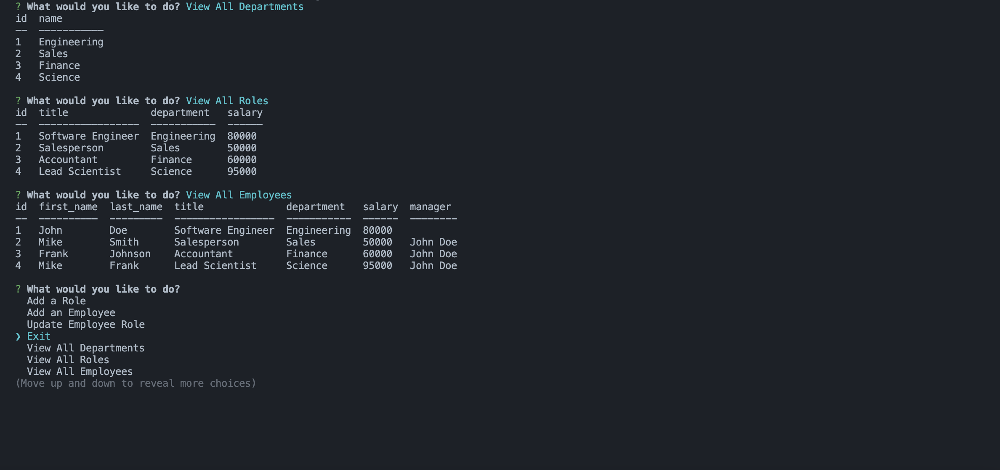

# Employee Tracker

The Employee Tracker Application is an interactive command-line tool designed to help businesses manage their organizational structure. Built using Node.js, PostgreSQL, and Inquirer, this application allows users to view and manage employees, roles, and departments dynamically through an intuitive CLI interface.

## Table of Contents

- [Overview](#overview)
- [Features](#features)
- [Technologies Used](#technologies-used)
- [Concepts Covered](#concepts-covered)
- [Learning Objectives](#learning-objectives)
- [How to Run](#how-to-run)
- [Future Improvements](#future-improvements)
- [Summary](#summary)



[Demo Video](https://drive.google.com/file/d/1M48NlHcInnTiO9S7ztp8oLBJPTzKRxHp/view?usp=sharing)

## Overview

The Employee Tracker Application enables businesses to streamline their human resources processes by allowing seamless management of employees, roles, and departments. Users can add, view, and update employee information, ensuring data integrity and consistency through PostgreSQL's relational database structure. The app also dynamically retrieves and displays organizational data in a tabular format for quick insights.

## Features

- **View All Departments**: Fetch and display a list of all departments in the organization.
- **View All Roles**: Retrieve and display all roles, their respective departments, and salaries.
- **View All Employees**: Display detailed employee information, including their roles, departments, salaries, and managers.
- **Add a Department**: Add new departments to the organizational structure.
- **Add a Role**: Create new roles and associate them with existing departments.
- **Add an Employee**: Add new employees, assign roles, and optionally specify their managers.
- **Update Employee Roles**: Modify an employee's role to reflect changes in their position.

## Technologies Used

- **Node.js**: The runtime environment for executing JavaScript on the server side.
- **PostgreSQL**: A robust relational database system for storing and managing organizational data.
- **Inquirer.js**: Handles interactive command-line prompts for user input.
- **dotenv**: Manages environment variables for secure database connections.
- **Console.table**: Formats data into easily readable tables in the terminal.

## Concepts Covered

- **Relational Database Management**: Using PostgreSQL to store and manage hierarchical data.
- **SQL Query Execution**: Writing and executing SQL queries dynamically based on user input.
- **Environment Configuration**: Securing sensitive credentials using environment variables.
- **Command-Line Interfaces**: Building an intuitive CLI for interacting with the database.
- **Dynamic Query Results**: Fetching and displaying relational data using JOINs and aggregations.

## Learning Objectives

1. Understand how to build a Node.js CLI application for database management.
2. Learn to connect and query a PostgreSQL database from a Node.js application.
3. Explore advanced SQL concepts such as JOINs and cascading relationships.
4. Practice securing database credentials with environment variables using dotenv.
5. Gain hands-on experience with asynchronous programming using promises and async/await.

## How to Run

1. **Clone the Repository**  
   Clone the project repository to your local machine:

   ```bash
   git clone https://github.com/BrockAltug/employee-tracker.git
   ```

   Navigate to the project directory:

   ```bash
   cd employee-tracker
   ```

2. **Set Up Environment Variables**  
   Create a `.env` file in the root directory with the following content:

   ```
   DB_USER=your_database_user
   DB_PASSWORD=your_database_password
   DB_HOST=localhost
   DB_DATABASE=your_database
   DB_PORT=5432
   ```

3. **Install Dependencies**  
   Install the required dependencies by running:

   ```bash
   npm install
   ```

4. **Set Up the Database**  
   Initialize the database by running the provided SQL scripts:

   ```bash
   psql -U your_database_user
   ```

   Create schema and insert sample data:

   ```bash
   \i schema.sql
   \i seeds.sql
   ```

5. **Run the Application**  
   Start the application by running:

   ```bash
   node index.js
   ```

6. **Interact with the CLI**  
   Follow the on-screen prompts to view and manage organizational data.

## Summary

The Employee Tracker Application is an essential tool for businesses looking to manage their organizational data effectively. By leveraging the power of Node.js, PostgreSQL, and Inquirer, this application provides a streamlined, user-friendly solution for HR and administrative tasks. It offers dynamic insights into the company structure, ensuring efficient and informed decision-making. Perfect for any organization seeking to enhance its employee management processes.
